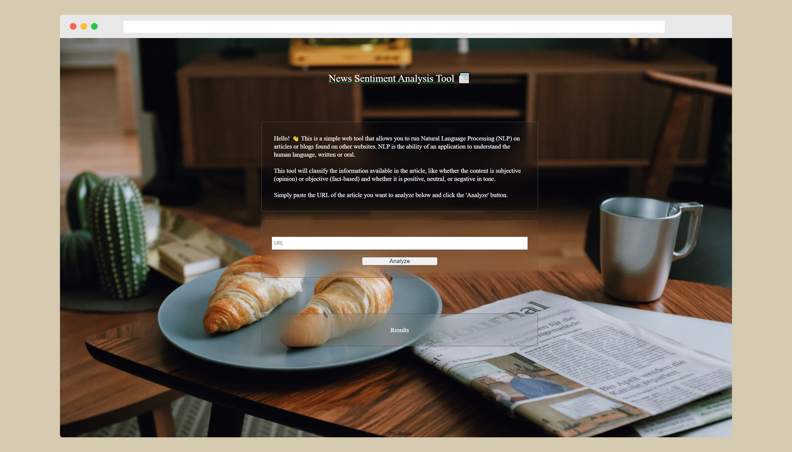

# Text Analysis Tool

## Table of Contents

* [Description](#description)
* [Technologies Used](#technologies-used)

## Description

The motive of this project was to have me taste of the environment and tools I will most likely come across in a front end role.

This project required me to build a web tool that allows users to run Natural Language Processing (NLP) on articles or blogs found on other websites. This tool will help users classify the information available in the article, like whether the content is subjective (opinion) or objective (fact-based) and whether it is positive, neutral, or negative in tone.

## Technologies Used
- HTML
- SCSS
- JavaScript
- Node.js
- Express.js
- Web API (MeaningCloud Sentiment Analysis API)
- Webpack
- Jest (Testing)
- Service Worker (External script)

## Author
[Jym Bocala](https://github.com/jymbocala)